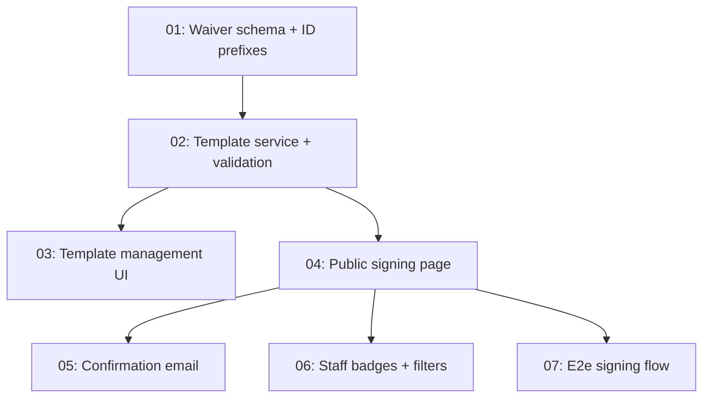

# Issues: Digital Waivers

> Generated from [plans/digital-waivers-design.md](../../plans/digital-waivers-design.md) on 2026-03-24
> Total issues: 7

## Dependency graph

## Execution order

| Order | Issue | Parallel with | Scope |
|-------|-------|--------------|-------|
| 1 | 01-waiver-schema.md | -- | 4 files, DB layer |
| 2 | 02-template-service.md | -- | 4 files, service + validation layer |
| 3 | 03-template-management-ui.md | 04 | 5 files, UI + actions layer |
| 3 | 04-public-signing-page.md | 03 | 7 files, page + service + action layer |
| 4 | 05-confirmation-email.md | 06, 07 | 3 files, email layer |
| 4 | 06-staff-badges-filters.md | 05, 07 | 5 files, query + UI layer |
| 4 | 07-e2e-signing-flow.md | 05, 06 | 2 files, test layer |

## Plan coverage

| Design phase / section | Issue |
|----------------------|-------|
| Phase 1: Schema + Template Management (schema) | 01-waiver-schema.md |
| Phase 1: Schema + Template Management (service) | 02-template-service.md |
| Phase 1: Schema + Template Management (UI) | 03-template-management-ui.md |
| Phase 2: Public Signing + Customer Integration | 04-public-signing-page.md |
| Phase 2: Email confirmation | 05-confirmation-email.md |
| Phase 3: Staff-Facing UI | 06-staff-badges-filters.md |
| Cross-cutting: E2e tests | 07-e2e-signing-flow.md |
