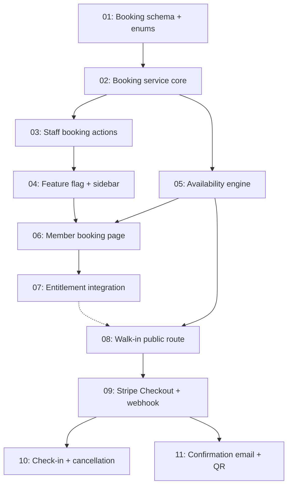

# Issues: Lane Booking

> Generated from [plans/lane-booking-design.md](../../plans/lane-booking-design.md) on 2026-03-24
> Total issues: 11

## Dependency graph

## Execution order

| Order | Issue | Parallel with | Scope |
|-------|-------|--------------|-------|
| 1 | 01-booking-schema-enums.md | -- | 5 files, 1 layer |
| 2 | 02-booking-service-core.md | -- | 4 files, 1 layer |
| 3 | 03-staff-booking-actions.md | 05-availability-engine.md | 5 files, 2 layers |
| 3 | 05-availability-engine.md | 03-staff-booking-actions.md | 3 files, 1 layer |
| 4 | 04-feature-flag-sidebar.md | -- | 3 files, 2 layers |
| 5 | 06-member-booking-page.md | -- | 5 files, 2 layers |
| 6 | 07-entitlement-booking.md | 08-walkin-public-route.md | 3 files, 1 layer |
| 6 | 08-walkin-public-route.md | 07-entitlement-booking.md | 6 files, 2 layers |
| 7 | 09-stripe-checkout-webhook.md | -- | 5 files, 2 layers |
| 8 | 10-checkin-cancellation.md | 11-confirmation-email-qr.md | 5 files, 2 layers |
| 8 | 11-confirmation-email-qr.md | 10-checkin-cancellation.md | 4 files, 2 layers |

## Plan coverage

| Design phase / section | Issue |
|----------------------|-------|
| Phase 1: Schema + Staff Booking | 01-booking-schema-enums.md, 02-booking-service-core.md, 03-staff-booking-actions.md, 04-feature-flag-sidebar.md |
| Phase 2: Member Self-Service | 05-availability-engine.md, 06-member-booking-page.md, 07-entitlement-booking.md |
| Phase 3: Walk-in Online Booking | 08-walkin-public-route.md, 09-stripe-checkout-webhook.md, 11-confirmation-email-qr.md |
| Phase 4: Check-in + Operations | 10-checkin-cancellation.md |
| Data Models: booking | 01-booking-schema-enums.md |
| Data Models: bookingEvent | 01-booking-schema-enums.md |
| Data Models: bookingRules JSONB | 05-availability-engine.md |
| Behavior: Create Booking (Member) | 06-member-booking-page.md, 07-entitlement-booking.md |
| Behavior: Create Booking (Walk-in) | 08-walkin-public-route.md, 09-stripe-checkout-webhook.md |
| Behavior: Create Booking (Staff) | 03-staff-booking-actions.md |
| Behavior: Stripe Webhook | 09-stripe-checkout-webhook.md |
| Behavior: Cancel Booking | 10-checkin-cancellation.md |
| Behavior: Check-in | 10-checkin-cancellation.md |
| Security: Permissions | 03-staff-booking-actions.md, 06-member-booking-page.md |
| Operational: Feature flag | 04-feature-flag-sidebar.md |
