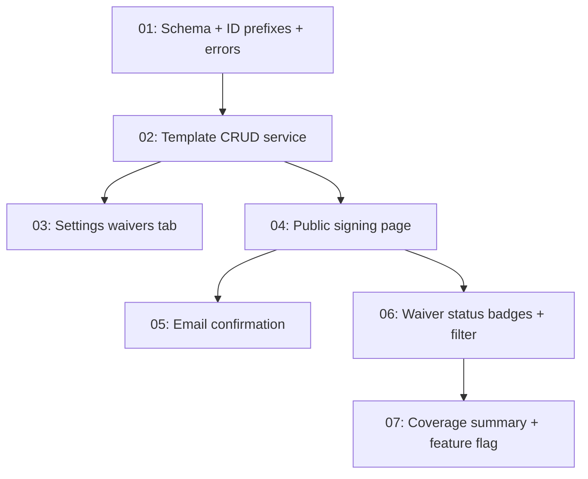

# Issues: Digital Waivers

> Generated from [plans/digital-waivers-design.md](plans/digital-waivers-design.md) on 2026-03-24
> Total issues: 7

## Dependency graph

## Execution order

| Order | Issue | Parallel with | Scope |
|-------|-------|--------------|-------|
| 1 | 01-schema-ids-errors.md | -- | 4 files, schema + lib |
| 2 | 02-template-crud-service.md | -- | 3 files, service + validation + queries |
| 3 | 03-settings-waivers-tab.md | 04 | 4 files, UI + actions |
| 3 | 04-public-signing-page.md | 03 | 6 files, page + action + service |
| 4 | 05-email-confirmation.md | 03 | 3 files, email template + service wiring |
| 5 | 06-waiver-status-badges.md | 05 | 4 files, query + UI + filter |
| 6 | 07-coverage-summary-flag.md | -- | 3 files, query + UI + settings |

## Plan coverage

| Design phase / section | Issue |
|----------------------|-------|
| Data Models: WaiverTemplate + Waiver tables | 01-schema-ids-errors.md |
| Data Models: Customer partial unique index | 01-schema-ids-errors.md |
| Behavior: Create/Edit/Preview/Publish Template | 02-template-crud-service.md, 03-settings-waivers-tab.md |
| Behavior: Sign Waiver (Adult + Minor) | 04-public-signing-page.md |
| Behavior: Email confirmation | 05-email-confirmation.md |
| Behavior: Check Waiver Status at Check-In | 06-waiver-status-badges.md |
| Behavior: View Waiver Coverage | 07-coverage-summary-flag.md |
| Feature flag gating | 03-settings-waivers-tab.md, 04-public-signing-page.md, 07-coverage-summary-flag.md |
| Rate limiting on public endpoint | 04-public-signing-page.md |
| Permission enforcement | 02-template-crud-service.md, 03-settings-waivers-tab.md |
