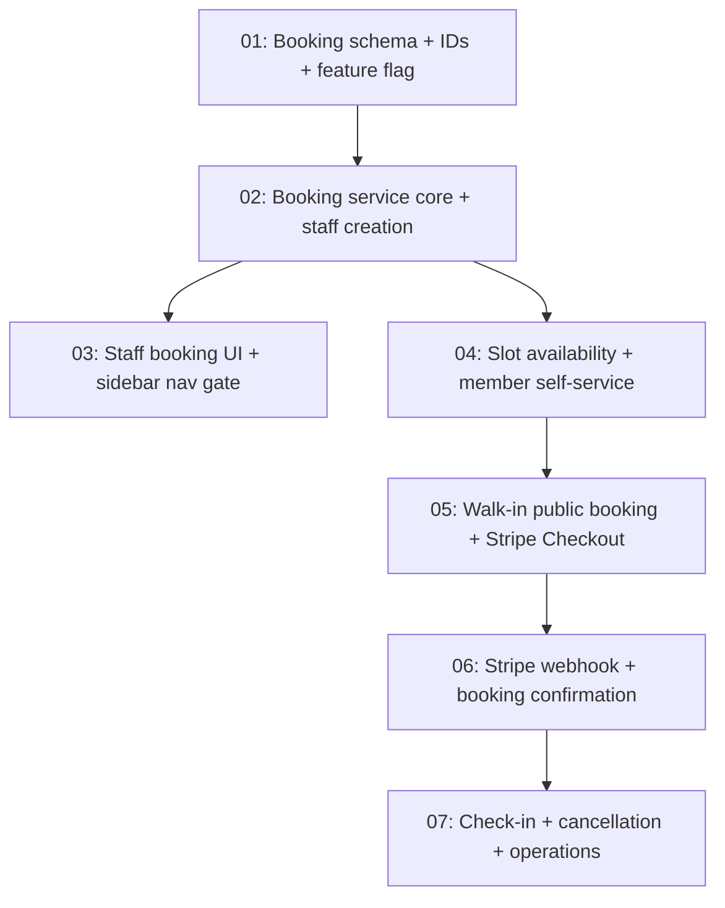

# Issues: Lane Booking

> Generated from [plans/lane-booking-design.md](../../plans/lane-booking-design.md) on 2026-03-24
> Total issues: 7

## Dependency graph

## Execution order

| Order | Issue | Parallel with | Scope |
|-------|-------|--------------|-------|
| 1 | 01-booking-schema.md | -- | 5 files, schema + config + validation |
| 2 | 02-booking-service-staff.md | -- | 6 files, service + action + errors + tests |
| 3 | 03-staff-booking-ui.md | 04 | 5 files, UI + sidebar + layout |
| 3 | 04-availability-member-booking.md | 03 | 6 files, service + action + validation + tests |
| 4 | 05-walkin-public-booking.md | -- | 6 files, route + layout + service + customer upsert |
| 5 | 06-stripe-webhook-confirmation.md | -- | 5 files, webhook + email + tests |
| 6 | 07-checkin-cancellation-ops.md | -- | 6 files, service + action + UI + tests |

## Plan coverage

| Design phase / section | Issue |
|----------------------|-------|
| Phase 1: Schema + Staff Booking (schema, IDs, feature flag) | 01-booking-schema.md |
| Phase 1: Schema + Staff Booking (service, staff creation) | 02-booking-service-staff.md |
| Phase 1: Schema + Staff Booking (UI, sidebar gate) | 03-staff-booking-ui.md |
| Phase 2: Member Self-Service (availability, auto-assign, entitlement) | 04-availability-member-booking.md |
| Phase 3: Walk-in Online Booking (public route, Stripe Checkout, customer) | 05-walkin-public-booking.md |
| Phase 3: Walk-in Online Booking (webhook, confirmation email, QR) | 06-stripe-webhook-confirmation.md |
| Phase 4: Check-in + Operations (check-in, no-show, cancel, refund, dashboard) | 07-checkin-cancellation-ops.md |
