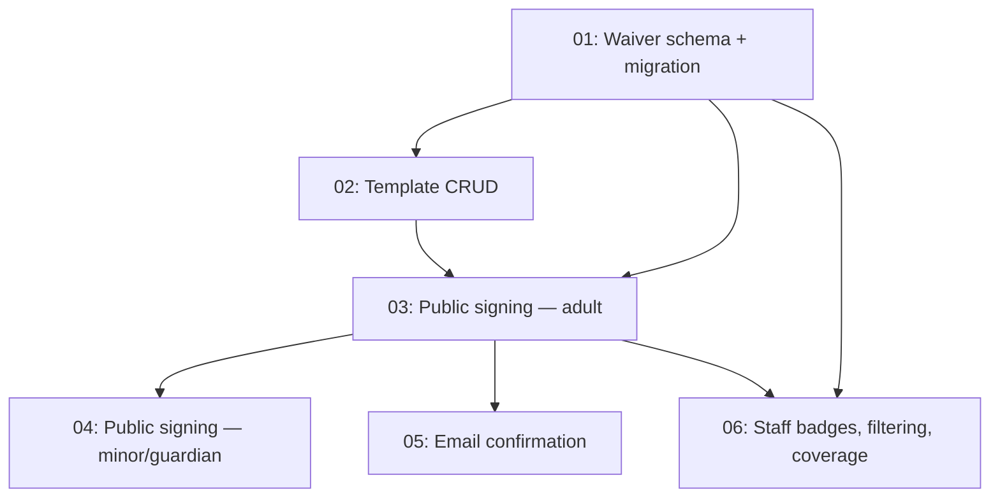

# Issues: Digital Waivers

> Generated from [design.md](../../../architect-workspace/iteration-1/digital-waivers-design/with_skill/outputs/design.md) on 2026-03-24
> Total issues: 6

## Dependency graph

## Execution order

| Order | Issue | Parallel with | Scope |
|-------|-------|--------------|-------|
| 1 | 01-waiver-schema.md | — | 5 files, 1 layer (data) |
| 2 | 02-template-crud.md | — | 6 files, 3 layers (service + action + UI) |
| 3 | 03-public-signing-adult.md | — | 6 files, 3 layers (page + action + service) |
| 4 | 04-minor-guardian-signing.md | #5 | 4 files, 2 layers (service + UI) |
| 4 | 05-email-confirmation.md | #4 | 4 files, 2 layers (email + service) |
| 5 | 06-staff-badges-filtering.md | — | 5 files, 3 layers (query + component + page) |

## Plan coverage

| Design phase / section | Issue |
|----------------------|-------|
| Phase 1: Schema + Template Management — schema, migration, ID prefixes | 01-waiver-schema.md |
| Phase 1: Schema + Template Management — template CRUD service, settings UI, feature flag, Tiptap editor, preview, publish | 02-template-crud.md |
| Phase 2: Public Signing — adult signing page, customer matching, waiver record, confirmation screen, rate limiting | 03-public-signing-adult.md |
| Phase 2: Public Signing — minor/guardian flow, guardian age validation | 04-minor-guardian-signing.md |
| Phase 2: Public Signing — email confirmation via Resend | 05-email-confirmation.md |
| Phase 3: Staff-Facing UI — waiver status badges, status filter, coverage summary | 06-staff-badges-filtering.md |
