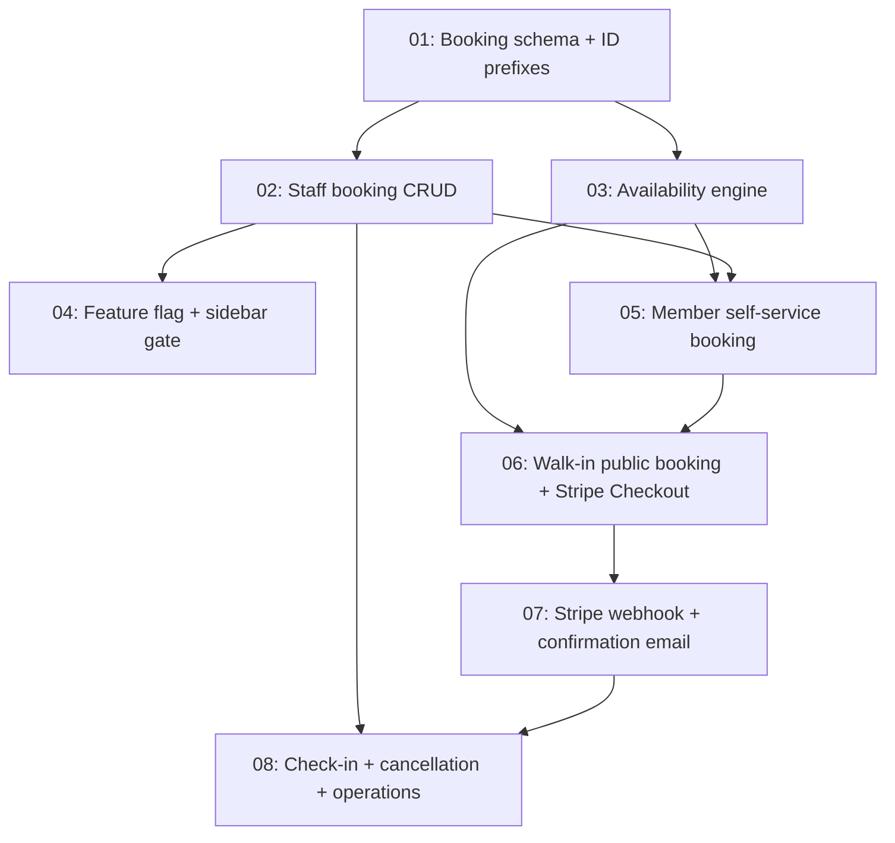

# Issues: Lane Booking

> Generated from [design.md](../../../../../architect-workspace/iteration-1/lane-booking-design/with_skill/outputs/design.md) on 2026-03-24
> Total issues: 8

## Dependency graph

## Execution order

| Order | Issue | Parallel with | Scope |
|-------|-------|--------------|-------|
| 1 | 01-booking-schema.md | -- | 4 files, schema layer |
| 2 | 02-staff-booking-crud.md | 03-availability-engine.md | 5 files, service + action + validation |
| 2 | 03-availability-engine.md | 02-staff-booking-crud.md | 3 files, service + test |
| 3 | 04-feature-flag-sidebar.md | -- | 3 files, UI + query |
| 4 | 05-member-self-service.md | -- | 5 files, page + action + service |
| 5 | 06-walkin-public-booking.md | -- | 5 files, public route + action + service |
| 6 | 07-stripe-webhook-email.md | -- | 4 files, webhook + email template |
| 7 | 08-checkin-cancel-ops.md | -- | 6 files, service + action + page |

## Plan coverage

| Design phase / section | Issue |
|----------------------|-------|
| Phase 1: Schema + Staff Booking (schema) | 01-booking-schema.md |
| Phase 1: Schema + Staff Booking (service + UI) | 02-staff-booking-crud.md, 04-feature-flag-sidebar.md |
| Phase 1: Schema + Staff Booking (state machine, confirmation code) | 02-staff-booking-crud.md |
| Phase 2: Member Self-Service (availability) | 03-availability-engine.md |
| Phase 2: Member Self-Service (booking page + entitlement) | 05-member-self-service.md |
| Phase 3: Walk-in Online Booking (public route + Stripe) | 06-walkin-public-booking.md |
| Phase 3: Walk-in Online Booking (webhook + email) | 07-stripe-webhook-email.md |
| Phase 4: Check-in + Operations | 08-checkin-cancel-ops.md |
