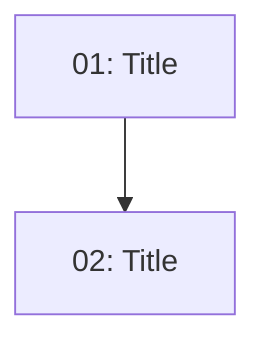

<!-- Template for plan skill. Write as ## Implementation Plan in the living doc. -->

## Implementation Plan

### Dependency Graph

### Execution Order

| Order | Issue | Parallel with | Scope |
|-------|-------|--------------|-------|
| 1 | 01-slug.md | — | N files, N layers |

### Plan Coverage

| Design phase / section | Issue |
|----------------------|-------|
| Phase 1: <name> | 01-slug.md |
