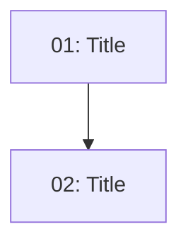

<!-- Implementation Plan. Create as ./plans/<feature-name>/plan.md -->
<!-- Standalone plan summary. Issues live in ./issues/<feature-name>/. -->

# Implementation Plan: <Feature Name>

> <date> | Issues: <N> | Auto: <N> | HITL: <N>
> TDD: [tdd.md](./tdd.md) | PRD: [prd.md](./prd.md)

## Dependency Graph

## Execution Order

| Order | Issue | Parallel with | Type | Scope |
|-------|-------|--------------|------|-------|
| 1 | 01-slug.md | — | Auto | N files |

## Requirements Coverage

| PRD Requirement | Issue |
|----------------|-------|
| FR-1: <name> | 01-slug.md |

## Design Phase Coverage

| TDD Phase | Issue |
|-----------|-------|
| Phase 1: <name> | 01-slug.md |
